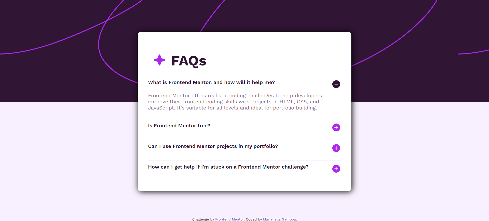

# Frontend Mentor - FAQ accordion solution

This is a solution to the [FAQ accordion challenge on Frontend Mentor](https://www.frontendmentor.io/challenges/faq-accordion-wyfFdeBwBz). Frontend Mentor challenges help you improve your coding skills by building realistic projects. 

## Table of contents

- [Overview](#overview)
  - [The challenge](#the-challenge)
  - [Screenshot](#screenshot)
  - [Links](#links)
  - [Built with](#built-with)
  - [What I learned](#what-i-learned)
  - [Useful resources](#useful-resources)
- [Author](#author)
- [Acknowledgments](#acknowledgments)

## Overview

### The challenge

Users should be able to:

- Hide/Show the answer to a question when the question is clicked
- Navigate the questions and hide/show answers using keyboard navigation alone
- View the optimal layout for the interface depending on their device's screen size
- See hover and focus states for all interactive elements on the page

### Screenshot




### Links

- Live Site URL: [live site URL](https://marianellag1.github.io/faq-accordion/)

## My process

### Built with

- Semantic HTML5 markup
- CSS custom properties


### What I learned

I had saved a 'three different ways to center a div' image i found online, and had the chance to use it in this challenge. I usually go with the common display flex way, but this one worked! Just glad I had it saved.


```css
.faq-box {
    position: absolute;
    top: 50%;
    left: 50%;
    transform: translate(-50%, 20%);
}
```

### Useful resources

- [TsbSankara](https://www.youtube.com/@tsbsankara) - Helped with how accordion works.
- [Google](https://www.google.com) - Where you find anything.


## Author

- Frontend Mentor - [@Marianellag1](https://www.frontendmentor.io/profile/Marianellag1)

## Acknowledgments

Credit for orignal faq challenge video [TsbSankara](https://www.youtube.com/@tsbsankara) on YouTube. 

